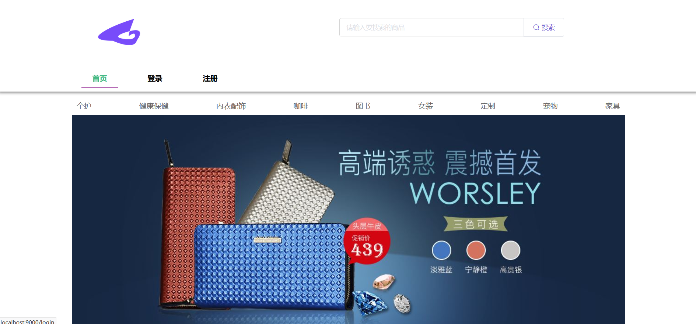
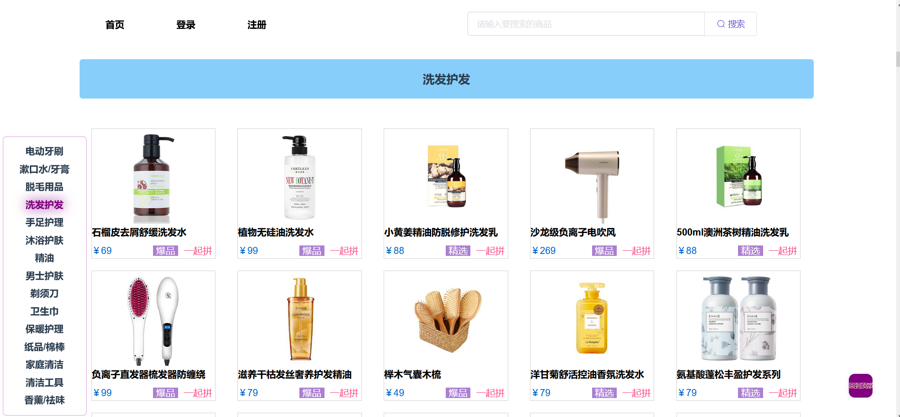
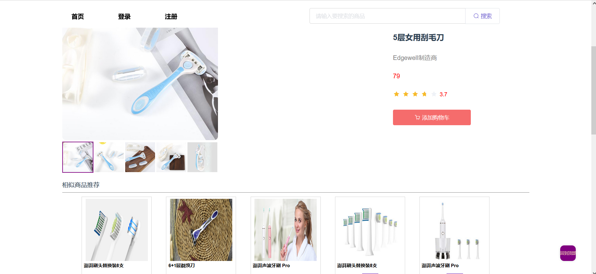

# 技术栈

vue2.0 + vue-router + vuex + axios + element-ui + vue-lazyload

## 简介

vuex + webStorage 实现了添加购物车功能,axios拦截,配合路由钩子函数实现权限控制、登录、登出功能

## 预览

       


## 待完成

购物车页面(暂时只能判断是否成功添加)

## Build Setup

``` bash
# install dependencies
npm install

# serve with hot reload at localhost:1322
npm run serve

# build for production with minification
npm run build

